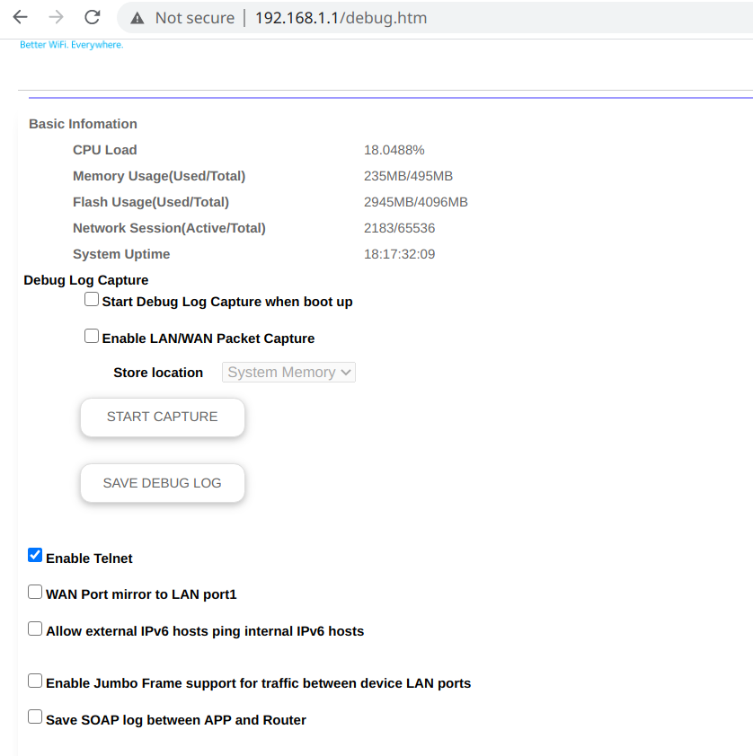

# ssh-rbr50
This is a step-by-step guide to enabling SSH on a Netgear Orbi RBR50, running firmware: V2.5.2.4.

Please note that this script only enables SSH on your internal network. Exposing SSH to the Internet is a good way to get your network hacked, so refrain of doing so. Use the VPN service if you want SSH access over the Internet.

Good reasons to do this are:
* You don't want to use (unencrypted) telnet to your system
* You don't want persistent (across reboot) terminal access to your system
* You need SSH access to do something
* You like to live dangerous and want to turn your system into a SSH jump host into your network

# Something may go wrong
Please note that doing this may very well void your guarantee. Don't do this if you don't know what your are doing.
In order to know what you are doing, you need to understart Linux.

We're using a bit defender init script to inject our scripts, this could potentially cause bit defender to not work properly.
AFAIKS, bit defender does work as expected, but don't take my word for it.

## Recovering from something which went wrong
As of this writing, a factory reset erases all changes.

This script was last tested 2020-11-02 on firmware V2.5.2.4.

# Installation
* Go to http://IP-OF-ORBI/debug.htm and enable ``telnet`` access as shown below.



* Telnet to your system and run below commands:
```
cd /mnt/bitdefender
wget --no-check-certificate https://raw.githubusercontent.com/mglantz/ssh-rbr50/main/start_ssh 
chmod a+rx start_ssh
./start_ssh
```
After this has been done once, SSH will start up automatically at reboot of your system. If you do a factory reset, these changes will be erased.

Be patient, it takes a couple of minutes before 1) your system boots 2) the SSH server launches.

## Persisting the SSH server keyfile
If you want to persist the keyfile for your SSH server, once you've logged in via SSH, run below command, once:

```
cp /etc/dropbear/dropbear_rsa_host_key /mnt/bitdefender
```

The script will now ensure this specific keyfile is used.

## General findings
* Netgear Orbi RBR50 runs OpenWRT
```
DISTRIB_ID='OpenWrt'
DISTRIB_RELEASE='Chaos Calmer'
DISTRIB_REVISION='r6043'
DISTRIB_CODENAME='chaos_calmer'
DISTRIB_TARGET='ipq806x/generic'
DISTRIB_DESCRIPTION='OpenWrt Chaos Calmer 15.05.1'
DISTRIB_TAINTS='no-all'
```
* / is emphemeral, changes are not persisted across reoot
* /mnt/bitdefender is persisted across reboot. Likely also is:
/mnt/circle
/mnt/ntgr
* /mnt/bitdefender is cleaned at factory reset
* /mnt/bitdefender/bin/bd_procd get's executed fairly quickly after boot, likely during runlevel 3.
* Interface br0 is the internal network bridge which owns the internal IP
* Interface brwan is the external network bridge which owns the external IP
* The admin user cannot be used to login via SSH
* Root user doesn't have a proper home directory, likely causes issues with ssh keys

# NOTE: Changing your passwords in the future
Please note, when you have first run the ``start_ssh`` script - the ``admin`` and ``root`` password becomes permanent and will reset at reboot of your device if you change them. 

To change the  ``admin`` or ``root`` password in the future, run:

```
passwd admin
passwd root
cp /etc/passwd /mnt/bitdefender/.shadow
cp /etc/shadow mnt/bitdefender/.passwd
```
